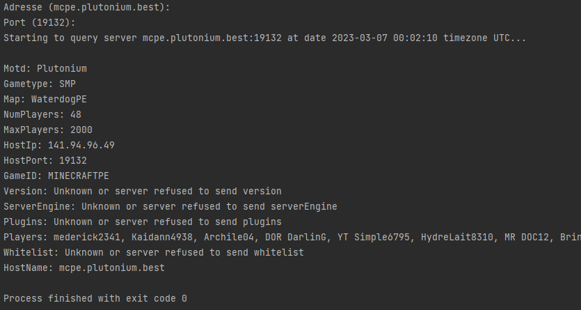

# Query
Multi thread query tools for Minecraft Bedrock Servers made in PHP (8.0 or higher)

Why does it support Multi Thread? Cause its fun :)

**Run the program and find informations about servers:**

## Dependencies

- PHP 8.0 or higher
- [PHP-Thread]

## How to use?

Simply run the program with the command `php src/Main.php` and follow the instructions.

Fell free use this program for your own projects.